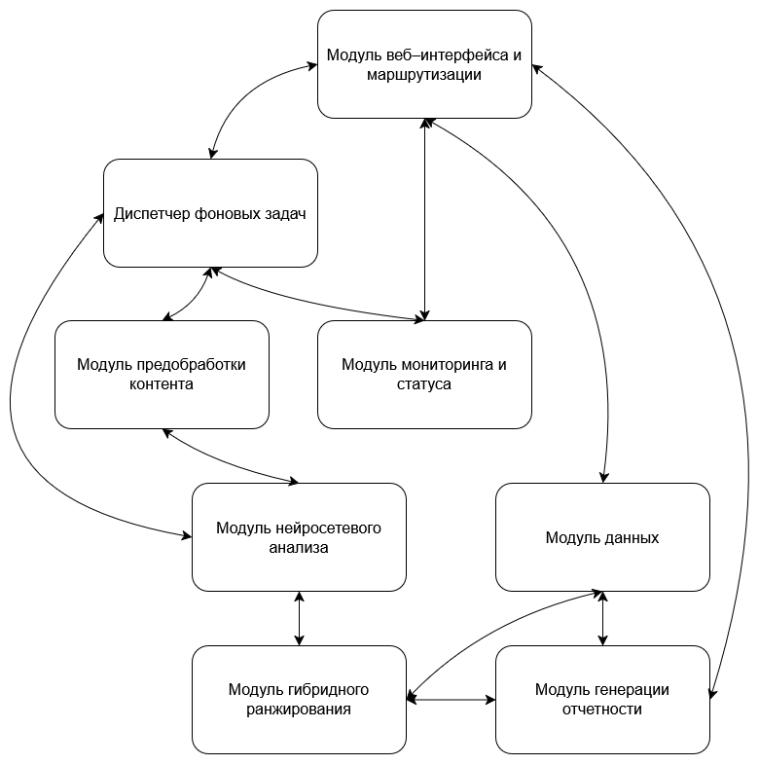

# Cross-Modal Music Curator

Система автоматически подбирает музыку по изображению.

Пользователь загружает изображение, система анализирует его содержание, цвета и настроение, переводит эти признаки в музыкальный профиль и предлагает наиболее подходящие треки.

## Что делает система

1. Принимает изображение в формате JPG или PNG.
2. Проверяет файл и преобразует изображение в RGB.
3. Определяет основные цвета и характеристики HSV.
4. Анализирует содержание изображения с помощью Qwen2.5-VL-3B-Instruct.
5. Формирует профиль из пяти параметров:
   - Valence — эмоциональная позитивность;
   - Energy — энергичность;
   - Danceability — танцевальность;
   - Acousticness — акустичность;
   - Instrumentalness — инструментальность.
6. Сравнивает профиль изображения с профилями треков в базе данных.
7. Ранжирует результаты с учётом:
   - косинусного сходства;
   - евклидова расстояния;
   - соответствия жанра;
   - популярности трека.
8. Показывает лучшие рекомендации.
9. Позволяет сохранить результат в CSV или JPEG.
10. Сохраняет оценки пользователей от 1 до 5 звёзд.

## Особенности

- Клиент-серверная архитектура.
- Асинхронная обработка запросов.
- FastAPI для REST API и веб-приложения.
- Qwen2.5-VL-3B-Instruct для анализа изображений.
- 4-битное NF4-квантование для снижения потребления VRAM.
- SQLite для хранения данных и оценок.
- Гибридное ранжирование музыкальных треков.
- OpenAPI/Swagger для описания API.
- UML-диаграммы для описания архитектуры.

## Архитектура

Система состоит из нескольких взаимосвязанных модулей: веб-интерфейса,
предобработки изображения, нейросетевого анализа, ранжирования музыки,
работы с базой данных и генерации результатов.

Основной поток обработки начинается с загрузки изображения и проходит через
анализ изображения, поиск подходящих треков и формирование рекомендаций.



Подробные диаграммы находятся в каталоге `docs/diagrams`.

## Алгоритм ранжирования

Для каждого трека рассчитывается итоговый балл:

```text
Score_total = 0.75 * S_hybrid + 0.15 * S_genre + 0.10 * P_norm
```

Где:

- `S_hybrid` — основная оценка сходства музыкального профиля;
- `S_genre` — насколько жанр трека соответствует жанрам, определённым для изображения;
- `P_norm` — нормализованная популярность трека.

Основная метрика:

```text
S_hybrid = 0.7 * S_cos + 0.3 * 1 / (1 + d)
```

`S_cos` — косинусное сходство, `d` — евклидово расстояние между профилями.

## REST API

Основные эндпоинты:

| Метод | Эндпоинт | Назначение |
|---|---|---|
| `POST` | `/analyze` | Загрузить изображение и запустить анализ |
| `GET` | `/status/{task_id}` | Проверить статус анализа |
| `GET` | `/result/{task_id}` | Получить результаты |
| `POST` | `/rate` | Сохранить оценку рекомендаций |
| `POST` | `/download_card` | Скачать JPEG-карточку |
| `POST` | `/download_csv` | Скачать плейлист в CSV |

Полная спецификация API находится в `docs/openapi.yaml`.

## Результаты тестирования

В работе использовалась выборка из 100 изображений разных типов: пейзажи, портреты, архитектура и абстрактные изображения.

Получены следующие результаты:

- средняя оценка пользователей — **4.39 из 5**;
- 85% оценок составили 4 или 5 звёзд;
- среднее гибридное сходство для рекомендаций Top-1 — **0.847**;
- пиковое потребление VRAM после NF4-квантования — **3.01 ГБ**;
- время обработки одного изображения — около **24 секунд**.

Полная версия системы тестировалась на базе более чем 2.5 млн треков.

## Локальный запуск

В репозитории используется облегченная база данных (`music.db`) на 100 000 композиций для быстрого локального запуска. Полная версия системы тестировалась на базе объемом 2.5М+ треков. 

### 1. Клонирование репозитория

```bash
git clone https://github.com/твой-логин/cross-modal-music-curator.git
cd cross-modal-music-curator
```

### 2. Установка зависимостей

```bash
pip install -r requirements.txt
```

### 3. Создание таблиц базы данных

```bash
sqlite3 src/music.db < db/schema.sql
```

### 4. Запуск приложения

```bash
cd src
uvicorn main:app --host 127.0.0.1 --port 8000 --reload
```

После запуска приложение будет доступно по адресу:

```text
http://127.0.0.1:8000
```

Документация API FastAPI/Swagger доступна по адресу:

```text
http://127.0.0.1:8000/docs
```

## Структура проекта

```text
.
├── db/
│   ├── README.md
│   ├── music.db
│   └── schema.sql
├── docs/
│   ├── openapi.yaml
│   ├── requirements.md
│   └── diagrams/
│       ├── Activity.png
│       ├── Class-Diagram.png
│       ├── Module-Interaction.png
│       ├── Sequence.png
│       └── Use-Case.png
├── src/
│   ├── main.py
│   └── static/
│       └── style.css
│   └── templates/
│       ├── index.html
│       ├── loading.html
│       └── result.html
├── .gitignore
├── README.md
└── requirements.txt
```

## Технологии

- Python
- FastAPI
- PyTorch
- Qwen2.5-VL-3B-Instruct
- SQLite
- Pandas
- NumPy
- scikit-learn
- Jinja2
- REST API
- OpenAPI / Swagger
- UML / PlantUML

## Ограничения

Система предназначена для локального запуска и требует видеокарту NVIDIA с 4 и более ГБ VRAM для работы мультимодальной модели.

Для снижения требований к памяти используется 4-битное NF4-квантование модели.

---

## Назначение проекта

Проект предназначен для автоматизации подбора музыкального сопровождения к визуальному контенту. Он может использоваться в видеомонтаже, дизайне, маркетинге, SMM и других задачах, где важно быстро подобрать музыку под настроение и визуальный стиль изображения.
